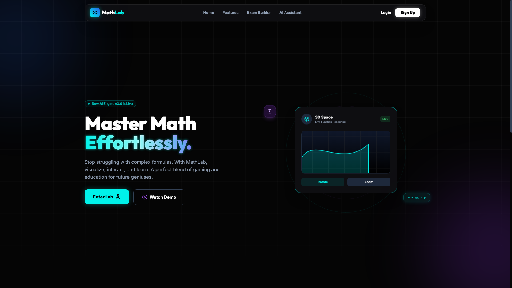
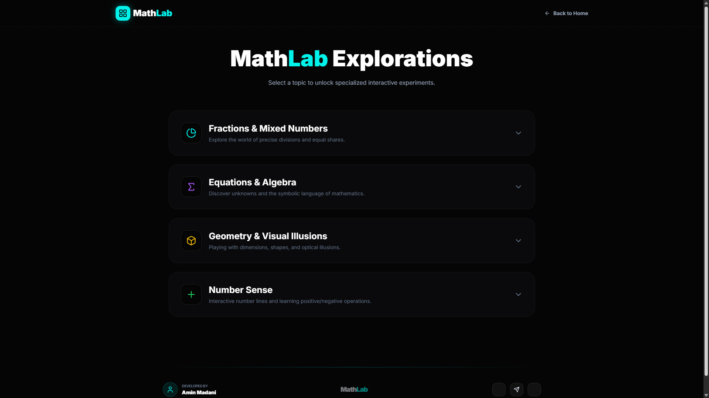
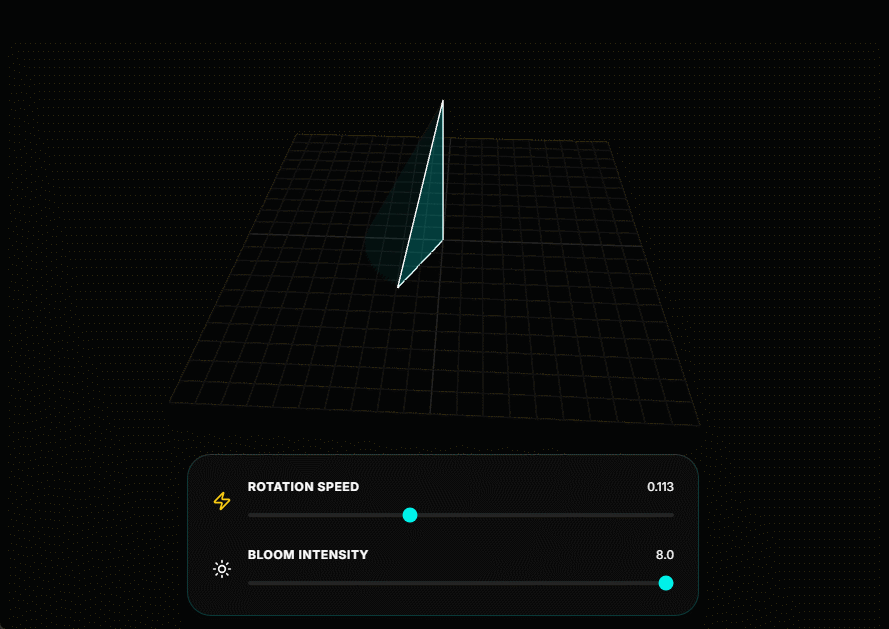

# 🧪 MathLab: Interactive Geometry & Vector Engine

**MathLab** is a modern, high-performance virtual laboratory designed to visualize complex mathematical concepts. By leveraging WebGL and modern web technologies, it transforms abstract theories like 3D rotations, vector operations, and negative integers into a tangible, interactive experience.

---

## 📸 Project Gallery

> **Tip:** Capture these screenshots in high resolution (1920x1080) for the best look.

### 1. Unified Dashboard (The Portal)

*The central hub of MathLab featuring a sleek, glassmorphic UI for seamless navigation.*

### 2. MathLab Explorations (Selection Menu)

*A dedicated selection interface showcasing available experiments with categorized modules.*

### 3. 3D Shape Designer (Cone Engine)

*Real-time visualization of the 'Solid of Revolution' theory, turning 2D shapes into 3D volumes.*

### 4. Offset Circle: Torus Birth

*Exploring advanced geometry by rotating offset circles to generate 3D Toroids (donuts) with neon trails.*

### 5. Vector Operations & Financial Lab

*Interactive number lines and drag-and-drop financial simulations to master integer mathematics.*

---

## 🚀 Key Features

- **3D Geometry Engine:** Built with `Three.js` for precise rendering of geometric volumes with custom neon bloom shaders.
- **Dynamic Vector System:** A custom SVG-based engine that treats number line operations as physical movements (vectors).
- **Gamified Financial Literacy:** An interactive UI to help students understand debts vs. assets using real-world analogies.
- **Cyber-Neon UI:** A high-end, responsive dark interface inspired by futuristic sci-fi aesthetics, built with `Tailwind CSS`.

---

## 🛠️ Tech Stack

- **Graphics:** [Three.js](https://threejs.org/) (WebGL)
- **Styling:** [Tailwind CSS](https://tailwindcss.com/)
- **Logic:** Vanilla JavaScript (ES6+)
- **Icons:** [Lucide-Static](https://lucide.dev/)
- **Typography:** Inter & JetBrains Mono

---

## 🗺️ Roadmap & Future Goals (To-Do)

This project is in active development. My vision for the future of MathLab includes:

- [ ] **🧠 AI Integration:**
    - Implementation of an **AI Tutor** to analyze student errors and suggest personalized learning paths.
    - Automated voice-over explanations for geometric transformations.
- [ ] **🔬 Advanced Experiments:**
    - **Function Plotter:** 2D and 3D graphing of algebraic equations.
    - **Physics Sandbox:** Visualizing projectile motion on a coordinate plane.
- [ ] **🎨 Design & UX Enhancements:**
    - Advanced Theme Engine (User-defined neon color palettes).
    - Fully accessible AR/VR mode using WebXR.
- [ ] **📊 Persistence Layer:**
    - User accounts to track progress and saved calculations via Firebase/Supabase.
- [ ] **📱 Native Mobile App:**
    - Exporting the lab as a native application using Capacitor or React Native.

---

## 🔧 Installation & Usage

To run MathLab locally, simply clone the repository and open `index.html` in any modern web browser:

```bash
# Clone the repository
git clone [https://github.com/YourUsername/MathLab.git](https://github.com/aminmadaniofficial/MathLab.git)

# Navigate to the project directory
cd MathLab

# Open index.html in your favorite browser!
````

-----

## 🤝 Contributing

Contributions make the open-source community an amazing place to learn and create. Any contributions you make are **greatly appreciated**.

1.  Fork the Project
2.  Create your Feature Branch
3.  Commit your Changes
4.  Push to the Branch
5.  Open a Pull Request

-----

## 👤 Author

**Mohammad Amin Madani** *Professional Full-stack Web Developer* 🌐 [Portfolio (aminmadani.xyz)](https://aminmadani.xyz) | 💼 [LinkedIn](https://linkedin.com/in/aminmadaniofficial)

-----

*Created with ❤️ to make mathematics visible and fun.*
